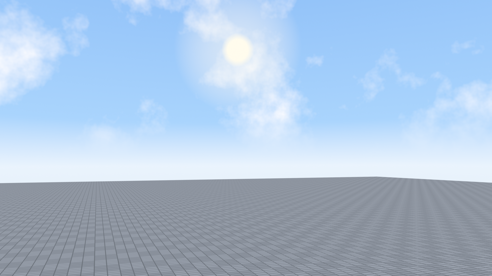

# slimsico

A Roblox-style starter scene modelled in Blender: a six-faced **skybox** with a
procedural sky (height gradient, noise clouds, sun disc) and a 512x512 stud
**baseplate** finished as glossy white 4-stud ceramic tiles with light grout.



## Files

- `build_scene.py` - builds the whole scene from an empty file, saves `slimsico.blend`, and renders `renders/scene.png`.
- `make_tile_texture.py` - draws `textures/tiles.png`, the 64x64 numbered grid of 8-stud tiles (column number on top, row number below, row 1 at the bottom-left). Needs Pillow.
- `build_character.py` - run inside Blender with the scene open: builds the smooth yellow Human Fall Flat styled crowned character as one connected Skin-modifier mesh with subdivision and an auto-generated armature, and switches the baseplate to the numbered grid texture.
- `slimsico.blend` - the saved scene.
- `renders/scene.png` - 1920x1080 EEVEE render.
- `renders/character_viewport.png` - viewport screenshot of the character on the grid.

## Rebuild

```
blender --background --factory-startup --python build_scene.py -- .
```

Made with Blender 5.0.
