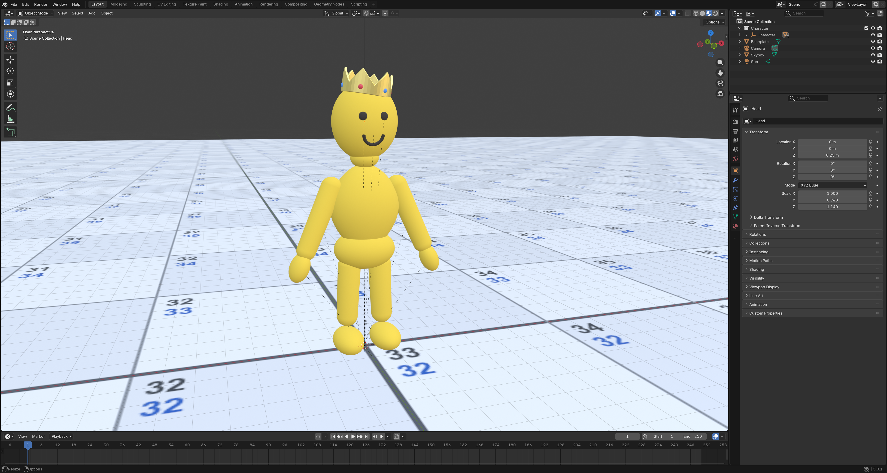

# slimsico

A stylised Blender scene and character: a six-faced **skybox** with a
procedural sky (height gradient, noise clouds, sun disc), a 512x512 stud
**baseplate** finished as a numbered grid of 8-stud tiles, and a smooth,
matte yellow, Human Fall Flat styled **character** wearing a gold crown.



## Goal

Build a polished, animation-ready character and set in Blender that would be
comfortable to use in a professional animated series:

- **One connected body.** No visibly separate parts and no faceting. The body
  is a single smooth mesh that flows from head to toes.
- **Rigged.** An armature is generated with the body so the character can be
  posed and animated straight away.
- **Distinct look.** Human Fall Flat proportions (egg head, chunky soft torso,
  sausage limbs, mitten hands) but its own identity: a big friendly head,
  matte yellow, and a crown.
- **Reproducible.** Everything is built by scripts checked into this repo, so
  the scene and character can be regenerated and tweaked by editing numbers,
  not by hand-modelling.
- **A usable set.** The baseplate grid is numbered so positions can be
  described by tile, for laying out props and blocking shots.

Progress against this goal is tracked in [CHANGELOG.md](CHANGELOG.md).

## Workflow

- **Animation is done with scripts.** Every beat is a `build_draft2_beatN.py` script run headless, with a few check frames rendered along the way, then the blend is saved and reopened in Blender to scrub. The Blender MCP bridge is only for modelling and quick viewport checks: it drops its connection on anything that runs longer than a minute or two, and a beat pass takes several minutes.
- Run `git pull` before starting work and push when you stop. Two people work on this repo.
- `slimsico.blend` is binary and cannot be merged: take turns on it, or split the work so one person has the blend while the other works on scripts and renders.
- A beat pass is slow because every frame the script touches re-evaluates the monster, the crate debris and the jetski. Turn their subdivision down while keying and restore it before saving.
- Render one beat for review with `python render_draft2.py --clip A B`; the full render is about an hour.

## Files

- `build_scene.py` - builds the whole scene from an empty file, saves `slimsico.blend`, and renders `renders/scene.png`.
- `make_tile_texture.py` - draws `textures/tiles.png`, the 64x64 numbered grid of 8-stud tiles (column number on top, row number below, row 1 at the bottom-left). Needs Pillow.
- `build_character.py` - run inside Blender with the scene open: builds the crowned character as one connected Skin-modifier mesh with subdivision and an auto-generated armature (`CharacterRig`), and switches the baseplate to the numbered grid texture.
- `rig_utils.py` - shared helpers for the animation scripts: keying with explicit interpolation, a parent-aware bone aimer, and a ground clamp that keeps the body's lowest point on the floor.
- `build_draft2.py` - draft 2 animation on the main scene (the peaceful plate, a sound from above, the camera finds Yellow tumbling far up in the sky and follows him down to a belly-flop landing).
- `build_draft2_beat4.py` - draft 2, beat 4 (frames 497-912): the line "I will walk around to find clues", the walk, the look up at a crate falling out of the sky, the run while it lands, the turn back, the crate bursting apart and the monster rising out of it and roaring.
- `build_draft2_beat5.py` - draft 2, beat 5 (frames 913-1080): Yellow backs away, trips over a plank and falls on his back; the monster stomps over, looms and reaches down, its claw hanging over him.
- `build_draft2_beat6.py` - draft 2, beat 6 (frames 1081-1656): Purple swoops in from the sky on the jetski, hovers beside Yellow and holds out his hand; "Who are you?"; Yellow grabs it and dangles as the jetski lifts and climbs, an insert on the slipping grip, the slip, Purple's one-handed catch, the haul up onto the passenger seat, then "Where are we going?", three seconds, "Hello, are you going to answer me?", "You're not much of a talker, are you?". Purple never speaks. Runs after beat 5 with Purple in the scene.
- **Purple** lives in `slimsico.blend` (the "Purple" collection), modelled by hand in Blender through the Blender MCP rather than by a script: Yellow's rig cloned and tinted purple, Yellow's own face with a straight mouth instead of the smile, a flat leather shoulder strap over the right shoulder ball and across the chest, a belt with a brass buckle and a gear pouch on the left hip, and two katanas carried tip-down across his back: curved single-edged polished-steel blades with a ridge, a bright edge and an angled tip, a pierced round iron guard, a black criss-cross wrapped grip over a pale under-wrap, and an iron end cap. Everything is bone-parented so the animation scripts drive him unchanged. Hidden from render until the story needs him.
- `build_crate.py` - one big breakable wooden crate; every part is parented to the `Crate` empty and remembers its rest transform.
- `build_monster.py` - the monster: a big rigged beast built with the same one-mesh Skin technique as Yellow (tusks, horns, claws, spikes, glowing eyes).
- `render_prep.py` - run inside Blender by the render script: shutter at frame start and camera keys held across cuts, so motion blur never smears one shot into the next.
- `subdiv_level.py` - lowers/restores the heavy meshes' subdivision around a headless beat pass (see its docstring for the command).
- `render_draft2.py` - renders draft 2 headless and mixes the sound (wind bed, the falling whistle, the splat) plus an optional music bed from `audio/ambient.*`.
- `build_hovercraft.py` - a flying jetski for Yellow modelled after a small runabout, sharp and futuristic: one hull mesh from cross-sections with every hard line creased (keel, chine, strake, gunwale, rail, deck side, footwell rims), painted purple hood, black hull and rear, white bow sides; footwells with mats, one sculpted two-seat unit with backrests, an integrated dash with a hologram projector and a floating holographic hover-screen behind it showing the animated HUD from `make_hud.py`, windshield, winged handlebars, light strips, rub rail, a thruster bay at the stern with glowing nozzles, boarding step; anti-grav pods with neon rings underneath that light the ground, neon chine lines and winglets; hovers with a gentle bob.
- `make_hud.py` - the hover-screen as a working device UI (craft name NIMBUS): a phone-like home screen with a live speed widget, app grid and dock, and thirteen animated app screens (Drive, Map, Messages with a typing keyboard, Calls, Music, Camera, Photos, Weather, Notes, Shop, Settings, Games, Lock) whose buttons all work. Renders a timeline of taps and typing to an image sequence: the idle loop to `textures/hud/`, `python make_hud.py demo` to `textures/hud_demo/`; story scripts call `render(events, out_dir, frames)`. Needs Pillow.
- `build_office.py` - builds the "OfficeTest" scene: an office set, the worker and police officer cloned from Yellow, and the three-attempt robbery with rewinds.
- `render_office_test.py` - renders OfficeTest and assembles it with the rewinds, subtitles, sound, and an optional music bed from `audio/ambient.*`.
- `slimsico.blend` - the saved scene: the set, Yellow on the grid (cleared between drafts), and the OfficeTest scene.
- `renders/scene.png` - 1920x1080 EEVEE render of the empty set.
- `renders/character_viewport.png` - viewport screenshot of the character on the grid.
- `renders/office_test.mp4` - the office robbery test scene with rewinds.
- `renders/draft2.mp4` - draft 2 so far: beats 1-6, 69 s, with music.
- `renders/hovercraft.png` - viewport shot of the flying jetski.
- `renders/hovercraft_dash.png` - the rider's view of the dash, hologram and hover-screen.
- `renders/hover_screen_demo.mp4` - the hover-screen demo: every app opened and used.
- `renders/monster.png`, `renders/monster_rise.png` - the monster roaring, and rising out of the burst crate.
- `renders/purple.png`, `renders/purple_back.png` - Purple from the front and from behind (the swords).
- `CHANGELOG.md` - full history of changes.
- `DRAFTS.md` - the draft log; each finished draft is archived under `drafts/` and tagged.

## Rebuild

Empty set, headless:

```
blender --background --factory-startup --python build_scene.py -- .
```

Grid texture:

```
python make_tile_texture.py
```

Jetski HUD frames (before running `build_hovercraft.py`):

```
python make_hud.py
```

Hover-screen demo video (needs ffmpeg on PATH):

```
python make_hud.py demo
ffmpeg -y -f lavfi -i color=c=0x14081f:s=540x800:r=24 -framerate 24 -i textures/hud_demo/hud_%04d.png -filter_complex "[0][1]overlay=shortest=1" -c:v libx264 -pix_fmt yuv420p -crf 20 renders/hover_screen_demo.mp4
```

Character: open `slimsico.blend` in Blender and run `build_character.py` from
the Text editor, then `build_draft2.py` for the current draft, and `build_crate.py`, `build_monster.py` then `build_draft2_beat4.py`, `build_draft2_beat5.py` and `build_draft2_beat6.py` for beats 4 to 6 (`build_crate.py` clears the whole Props collection, so run `build_hovercraft.py` after it; beat 6 needs the jetski) (the beat scripts also run headless: `blender -b slimsico.blend --python build_draft2_beat5.py`). Finished drafts
are archived under `drafts/`; see `DRAFTS.md`.

Draft 2 video with sound (needs ffmpeg on PATH):

```
python render_draft2.py
```

Only a new tail (frames 913 on), spliced onto the kept raw render:

```
python render_draft2.py --from 913
```

Office test scene (run `build_office.py` in Blender first):

```
python render_office_test.py
```

Made with Blender 5.0.

## Credits

- Music: "Volatile Reaction" by Kevin MacLeod (incompetech.com), licensed under Creative Commons: By Attribution 4.0 (https://creativecommons.org/licenses/by/4.0/). Placed at `audio/ambient.mp3`; `render_draft2.py` mixes it under the picture.
